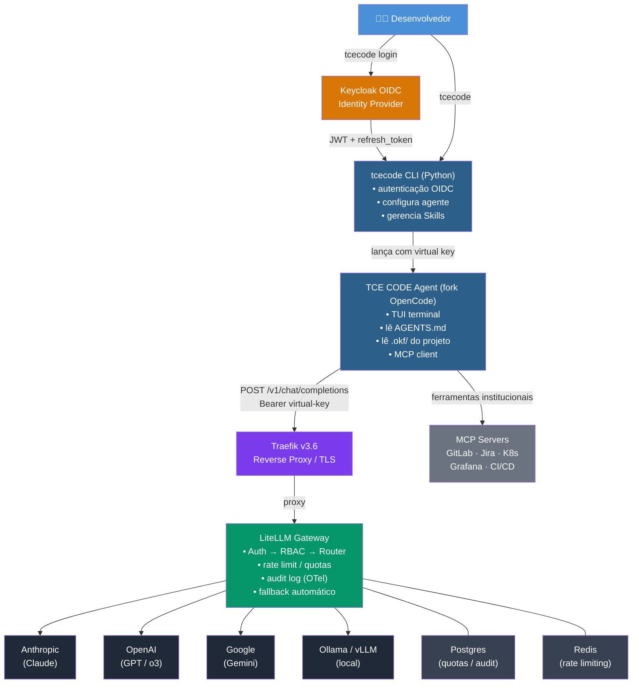

# Institutional AI Engineering Platform — Visão Geral

## Princípio fundamental

> O código pertence à squad. Os padrões pertencem à instituição. O contexto pertence ao projeto. Os modelos pertencem à plataforma.

O desenvolvedor tem liberdade para desenvolver, mas dentro de um **Golden Path institucional**. A IA atua como um **Engineering Assistant**, não como um chatbot.

---

## Arquitetura de referência



---

## Componentes

### tce-ai CLI
Wrapper Python (Typer) que o desenvolvedor instala e executa. Responsável por autenticar, configurar o coding agent com o gateway e lançar a sessão. Não armazena API keys de provedores — apenas o JWT do desenvolvedor.

### OpenCode
Coding agent Go que o desenvolvedor usa interativamente. Lê AGENTS.md e .okf/ do projeto atual. Conecta ao AI Gateway via API OpenAI-compatible. Suporta MCP para ferramentas institucionais.

### AI Gateway (LiteLLM Proxy)
Proxy central que abstrai todos os provedores de IA. Expõe modelos lógicos institucionais. Aplica autenticação, RBAC, quotas, custos e fallback. Único ponto que conhece as API keys reais dos provedores.

### Keycloak
Identity Provider institucional. Emite JWTs com identidade do desenvolvedor, squad e roles. O `tcecode login` usa ROPC Grant para obter o JWT. Na Fase 2, o JWT é para identidade no tcecode; o acesso ao LiteLLM ainda usa virtual key por squad. Fase 3 introduz ForwardAuth JWT→virtual key.

### MCP Servers Institucionais
Servidores MCP que expõem ferramentas institucionais ao coding agent: GitLab, Jira, Kubernetes, OpenSearch, Grafana, CI/CD. Cada ferramenta com autenticação, autorização e auditoria própria.

### Agentes Especializados (A2A)
Agentes com responsabilidade específica (Arquitetura, Segurança, DevOps, Testes) acionados via A2A pelo coding agent quando necessário. Fase 5.

---

## Hierarquia de regras

```
Institutional Rules  (políticas globais, imutáveis)
        │
        ▼
Architecture Rules   (padrões arquiteturais — hexagonal, DDD, SOLID)
        │
        ▼
Squad Rules          (convenções da squad)
        │
        ▼
Project Rules        (AGENTS.md + .okf/ do projeto)
        │
        ▼
Developer            (customizações pessoais, não violam regras acima)
```

---

## Golden Path

O caminho padrão para um desenvolvedor usar a plataforma:

```bash
tce-ai login                    # autenticar (OIDC)
tce-ai                          # iniciar sessão de coding com OpenCode
tce-ai new-project meu-servico  # criar projeto a partir de template institucional
tce-ai skills list              # listar skills disponíveis
tce-ai models                   # listar modelos lógicos disponíveis
```

---

## Fluxo padrão do agente (por tarefa)

```
1. Understand   → lê AGENTS.md, .okf/index.md, entende o projeto
2. Inspect      → analisa arquivos relevantes à tarefa
3. Plan         → apresenta plano (para tarefas complexas)
4. Validate     → valida aderência arquitetural antes de implementar
5. Implement    → escreve código seguindo padrões institucionais
6. Test         → executa testes, valida cobertura
7. Security     → verifica padrões de segurança (OWASP)
8. Observability → valida logs, métricas, traces
9. Docs         → atualiza documentação relevante
10. OKF         → atualiza .okf/ se houver decisão/conhecimento novo
11. Git Review  → apresenta diff antes de commit
```

---

## Decisões relacionadas

- [adr-001-stack](/decisions/adr-001-stack.md) — Python + OpenCode + LiteLLM
- [adr-002-coding-agent](/decisions/adr-002-coding-agent.md) — OpenCode
- [adr-003-ai-gateway](/decisions/adr-003-ai-gateway.md) — LiteLLM
- [adr-004-identity](/decisions/adr-004-identity.md) — Keycloak
- [adr-005-repositories](/decisions/adr-005-repositories.md) — Multi-repo

## Relacionamentos

- [ai-gateway](/architecture/ai-gateway.md)
- [security-model](/architecture/security-model.md)
- [multi-agent](/architecture/multi-agent.md)
- [phases-roadmap](/reference/phases-roadmap.md)
- [logical-models](/reference/logical-models.md)
