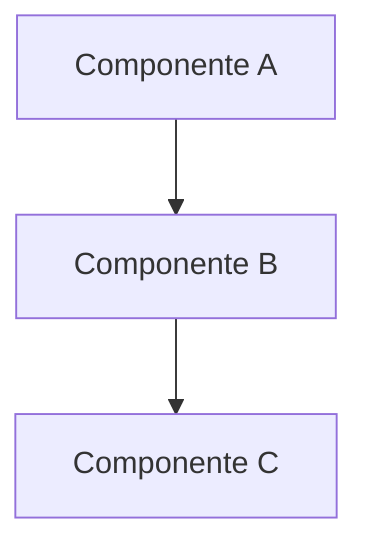

# Habilitar Mermaid no Viewer OKF

O viewer OKF (`viz.html`) usa `marked` para renderizar o corpo dos concepts em Markdown.
Por padrão, blocos ` ```mermaid ` são exibidos como código puro — não renderizados.

Este runbook aplica o patch que ativa a renderização via [Mermaid.js](https://mermaid.js.org).

---

## Pré-requisitos

- Skill OKF instalada em `~/.claude/skills/okf/vendor/knowledge-catalog/okf/`
- Python 3 disponível no PATH

---

## Opção 1 — Script automatizado (recomendado)

Na raiz do repo `tcecode`:

```bash
bash scripts/patch-okf-mermaid.sh
./viz.sh
```

O script é idempotente: pode ser rodado múltiplas vezes sem duplicar o patch.

---

## Opção 2 — Manual (para outros agentes ou máquinas)

### Passo 1 — Adicionar script Mermaid ao template HTML

Arquivo: `~/.claude/skills/okf/vendor/knowledge-catalog/okf/src/reference_agent/viewer/templates/viz.html`

Após a linha com `marked.min.js`, adicionar:

```html
<script src="https://cdn.jsdelivr.net/npm/mermaid@11/dist/mermaid.min.js"></script>
```

### Passo 2 — Adicionar renderização ao viz.js

Arquivo: `~/.claude/skills/okf/vendor/knowledge-catalog/okf/src/reference_agent/viewer/static/viz.js`

Localizar o bloco:
```js
    rewriteInternalLinks(bodyEl);
```

Adicionar imediatamente após:
```js
    // render mermaid diagrams inside the detail panel
    bodyEl.querySelectorAll("pre code.language-mermaid").forEach((el) => {
      const src = el.textContent || "";
      const wrapper = document.createElement("div");
      wrapper.className = "mermaid";
      wrapper.textContent = src;
      el.parentElement.replaceWith(wrapper);
    });
    if (bodyEl.querySelector(".mermaid")) {
      const theme = document.documentElement.dataset.theme === "dark" ? "dark" : "default";
      mermaid.initialize({ startOnLoad: false, theme });
      mermaid.run({ nodes: bodyEl.querySelectorAll(".mermaid") });
    }
```

### Passo 3 — Regenerar o viz.html

```bash
./viz.sh
```

---

## Como usar nos concepts OKF

Em qualquer arquivo `.md` do bundle, adicione um bloco mermaid:

```markdown

```

Ao clicar no concept no grafo, o diagrama será renderizado automaticamente,
respeitando o tema claro/escuro da interface.

---

## Contexto da implementação

Aplicado pela primeira vez no bundle `tce-ai-platform` em 2026-08-10.
O patch foi necessário porque o viewer original não inclui suporte a Mermaid.
A abordagem: `marked` converte ` ```mermaid ` em `<pre><code class="language-mermaid">`,
e o patch substitui esses elementos por `<div class="mermaid">` antes de chamar `mermaid.run()`.

## Relacionamentos

- [phases-roadmap](/development/phases-roadmap.md)
- [quality-gate](/development/quality-gate.md)
